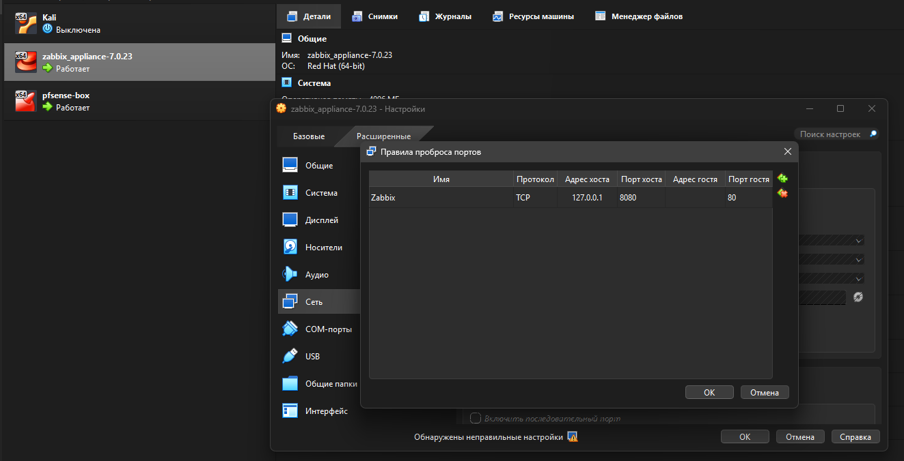

Takze, měl jsem docela hodně problemu během instalace pfSence a Zabbix Appliance. Konečně jsem je nastavil na NAT + intnet tak, aby se mohli pingovat navzajem(192.168.1.1, 192.168.1.10)
 

udělal jsem portforvarding 

ale pfSense pořad děla nejake blbosti, nechce se otevirat Web GUI i když je nastaven spravně, přestal se spouštět prez vagrant up atd.

Po 20-30 minut oprav - pfsense web gui stale nefunguje.
